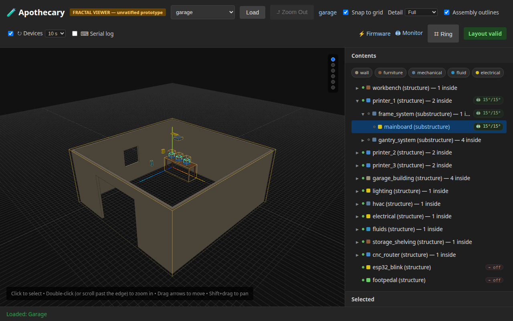
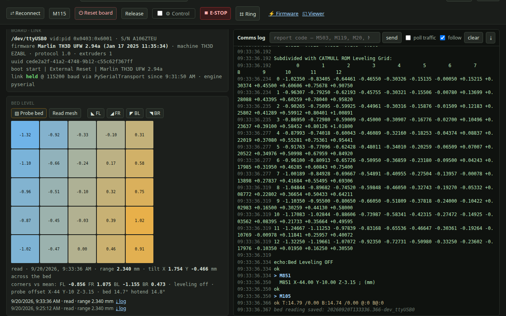
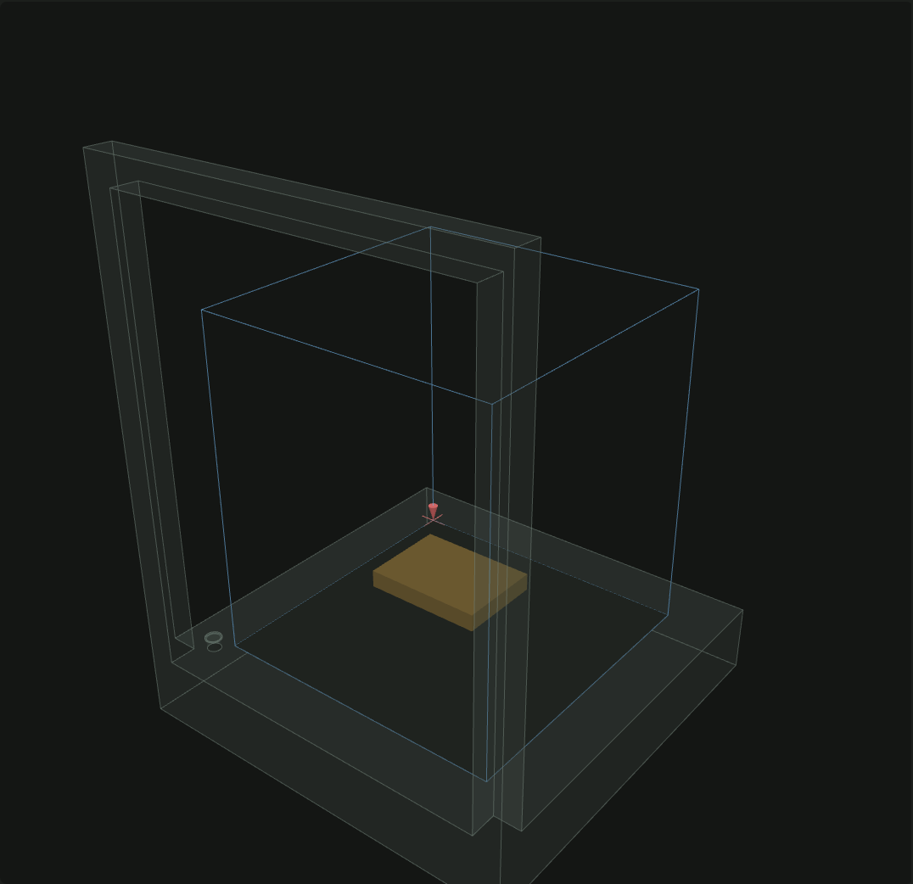

# Bench validation: the Ender mainboard, 2026-09-20

The printer seam, the monitor and the ring against the real board -- a
Creality Ender mainboard (FTDI FT232R bridge, serial `A106ZTEU`) running
**Marlin TH3D UFW 2.94a** with an EZABL probe -- plugged into this machine at
09:18 and left idle and cold (bed 13 °C, hotend 15 °C). Everything below was
done **without arming control**: identification, polling, report-only
queries, a read of the stored mesh, pins, the pages. What needs the latch is
left to the checklist at the end.

Three defects were found and fixed on the spot, each with a test that would
have caught it; they are in the changelog under *Fixed*.

## What was verified

| Step | Result |
|---|---|
| `apothecary firmware devices` | `/dev/ttyUSB0 vid=0x0403 pid=0x6001`, S/N `A106ZTEU`; the board had come back as `ttyUSB0` after a night as `ttyUSB1` |
| `apothecary firmware printer /dev/ttyUSB0` (first open after the plug-in) | identified in 7.9 s; the boot banner (`start / External Reset / Marlin TH3D UFW 2.94a`) landed -- the bridge comes up with DTR dropped, so the first open reboots the board, as the doc now says |
| `POST /firmware/devices/identify` (no reset), from the server, right after the CLI closed the port | **a second banner** -- the pyserial engine had left `HUPCL` set, so the CLI's close dropped DTR and the server's open reset the board. Fixed (`gcode.keep_dtr_on_close`, cleared on open by both engines); afterwards `stty -a` reads `-hupcl` |
| release → CLI query → server reopen, three processes in a row, after the fix | no banner; `M119` and `M851` answered over the CLI in between |
| `GET /firmware/printers/status` | 0.11 s, then 0.08 s per poll over the held link; state `idle`, endstops open, filament `TRIGGERED` → present, SD not printing |
| Report-only queries | `M420 V` (26 lines: the 5×5 bilinear grid, the 13×13 subdivided grid, `echo:Bed Leveling OFF`), `M851` (`M851 X-44.00 Y-10.00 Z-3.15 ; (mm)`), `M503` (59 lines, with 25 `G29 W` points), `M119`, `M20` (four `.GCO` files on the card), `M31`, `M92`; `M78` and `M122` answer `Unknown command` on this firmware and are harmless |
| `gcode.parse_meshes` / `mesh_stats` / `parse_probe_offset` / `parse_leveling_state` on the real replies | 5×5 measured and 13×13 subdivided grids; **range 2.340 mm, tilt X +1.754 mm and Y −0.466 mm across the bed, corners vs mean FL −0.856 FR +1.075 BL −1.155 BR +0.473**; leveling off; offset X−44 Y−10 Z−3.15. The `G29 W` points in `M503` gather into the same 5×5 |
| `POST /firmware/printers/level` with `probe: false` (Read mesh) | job `reading → saved` in 0.22 s; record `20260920T132512.468-dev_ttyUSB0` under `~/.apothecary/leveling/` with the mesh, the offset, the temperatures and every line; the page's Read mesh button made a second one |
| Pin to `printer_1.frame_system.mainboard` | stored as `A106ZTEU` (the board, not the socket); `GET /firmware/printers/where` answers the board, `printer_1`, volume 220×220×250 on a 50 mm base; each poll syncs `printer_1` *via* the board |
| Viewer, Device section on the mainboard | `/dev/ttyUSB0 · Marlin TH3D UFW 2.94a · TH3D EZABL (pinned)`, the last poll, Watch / Poll now / Monitor / Unpin; the printer's Contents row wears `🖨 15°/15°` |
| Monitor page | first status in 0.56 s; cards, temperature chart after a few 2 s polls, comms log, Bed level card with the real heatmap, Print card empty, Control unchecked and the overlay absent; addresses `⌗77` Control › Arm, `⌗748` Probe, `⌗746` Read, `⌗794` Send file, `⌗71` E-STOP, `⌗18` Reconnect; the ring opens on `m` with Link / Monitor / Rescan / Query / Poll / Control / Watch / Unpin; no console errors |
| Board in its printer | drawn -- **after a fix**: the printer's own shape had been placed a bench-width away (a node's STL arrives in its parent's frame); now the printer encloses its board and its volume, and the browser test checks the drawn bounds |
| Firmware page | the card identifies the printer, offers Poll and ⤢ Monitor only, draws the board in `garage › printer_1` |
| Test suites with the board plugged in | 1123 unit passed, 2 skipped; 67 e2e passed, 1 skipped -- after two audit fixes: the firmware-page test accepted only "no devices" or a devkit's *Probe* and failed on a real printer's *Monitor*; and the shared e2e server used the person's own `~/.apothecary`, so a test could have edited real pins -- it now keeps its state in a folder of its own |

## What the numbers say about the machine

The stored mesh is the bed as it was last probed, and it is far from
level: 2.34 mm from the lowest point (back left) to the highest (front
right), most of it a tilt across X. Bed leveling is **off** in the firmware
(`M420 S0`). Either the bed was re-trammed after that probe and the mesh is
stale, or the bed screws need a turn -- the corner buttons and a fresh probe
(checklist D) will say which. A mesh this large should not be compensated
with the probe alone; tram first, probe after.

## Manual checklist (needs the latch)

Preconditions: printer powered, bed clear, nothing printing from the card,
filament loaded. `uv run apothecary serve` on :8000 (the `--reload` server is
fine) and the monitor at `/firmware/monitor?port=/dev/ttyUSB0` -- use
whatever port `apothecary firmware devices` shows; the pin follows the
board. State `idle`, temperatures near room. Keep a hand near the printer's
own power switch; **E-STOP** is on the page but a switch is faster.

Every line the page sends is amber in the comms log; refusals are said in
the log too. ✔ as you go.

**A. Link, no arm**

- [ ] Pull the filament out of the runout sensor: within one poll (2 s on
      auto-poll) the endstop chip reads `filament OUT`; push it back →
      `present`. (Confirms `TRIGGERED` = present on this sensor.)
- [ ] **⏻ Reset board** → confirm → the boot banner lands in the log, the
      link is kept, the next poll answers. (`⌗16` from the ring: `1` Link,
      `6` Reset.)

**B. Arm and heat**

- [ ] **⚙ Control** → the overlay opens, the header counts down from 5:00,
      the ring's cell 7 › 7 reads *Disarm*.
- [ ] Bed **45** → Set: `M140 S45` in the log, the bed card's target reads
      `/ 45°` on the next poll, the bar fills as it warms. **Off** → target 0.
- [ ] Hotend **150** → Set, watch it climb, **Off**. (Below printing
      temperature on purpose; nothing extrudes.)
- [ ] Fan slider to ~128 → Set → the part fan spins; **Off**.
- [ ] Type **900** in the hotend box → Set: refused *before* the port
      (`above 300` in the log; no `M104 S900` line).
- [ ] Let it sit 5 minutes without a command: the latch lapses, the overlay
      closes, the API answers 409 to a control.

**C. Motion**

- [ ] **Home XY**, then **Home Z** (or `G28` all): X and Y home, the EZABL
      probes at the bed centre; the position card reads X0 Y0 and a Z.
- [ ] Step **10**, **Y+**: the bed moves 10 mm; the nozzle marker in *Board
      in its printer* moves the moment the button is pressed and the position
      card confirms within 2 s. From the ring: `m` `7` `2` `8` (⌗728) does the
      same; **Y−** twice, then **Motors off**.
- [ ] Bed level card, **◣ FL**: four lines (`G90`, `G1 Z5`, `G1 X30 Y30`,
      `G1 Z0.2`), the nozzle parks at the front-left corner at paper height.
      Slide a sheet of paper. **FR**, **BL**, **BR** likewise -- the stored
      mesh predicts the right side high (paper binds) and the left low.
      Adjust the screws if that is what you find. **Home Z** afterwards.

**D. Leveling**

- [ ] **▤ Probe bed** (⌗748) → confirm: the state card says
      `leveling: homing`, then `probing`; the temperature cards keep
      updating; a jog pressed meanwhile is refused with *a bed reading holds
      the port*. Two to three minutes for 25 points. When it says `saved`
      the heatmap redraws and the history has a *probe* row above the two
      *read* rows -- compare its range with 2.340 mm.
- [ ] **Mesh on** (`M420 S1`), then **Read mesh**: the record says
      *leveling on*. Note: the seam never writes EEPROM, so to keep the new
      mesh across a power cycle use the printer's own screen (*Configuration
      › Store settings*) -- or leave leveling off and let a slicer's start
      G-code turn it on.

**E. Print from here**

- [ ] *Print from here* → **Choose File** → `docs/validation/dry-run-square.gcode`
      (23 lines; nothing heats or extrudes). It lists as `dry-run-square.gcode
      · 23 lines`.
- [ ] Choose a file that must be refused: any `.gcode` with an `M500` line
      lists with *refused: line N: M500 saves settings to EEPROM* and
      **Print** stays refused for it.
- [ ] **▶ Print** (⌗794) → confirm: the head homes and traces a 60 mm square
      10 mm above the bed; the state card reads `printing` with the
      percentage, the card shows `sent/23` and the line in flight; the log
      shows *print started* and none of the lines.
- [ ] **⏸ Pause** mid-square (or `m` `7` `9` `6`): the head finishes what
      was queued and stops; `paused` in the card; a poll still answers.
      **▶ Resume** (needs the latch).
- [ ] **■ Cancel** → confirm: `M104 S0`, `M140 S0`, `M107`, `M84` in amber;
      the history row reads *cancelled · N/23*; the record is under
      `~/.apothecary/prints/records/`.
- [ ] Print it again to the end: *done · 23/23*, `M117 dry run done` on the
      printer's screen, the state card back to `idle`.
- [ ] Optional: a real sliced file with your usual start G-code. Watch for
      stutter on long straight moves -- that is the seam record's trigger for
      line numbers and checksums (alternative 7).

**F. Stop and let go**

- [ ] **E-STOP** (⌗71) with the printer idle: `Error:Printer halted. kill()
      called!` in the log, the next poll goes `offline`; **⏻ Reset board**
      brings it back.
- [ ] **Release** → the link drops, the latch with it; `apothecary firmware
      printer /dev/ttyUSB0` from a terminal answers **without a boot banner**;
      **⇄ Reconnect** on the page holds it again, also without one.

Anything refused, wrong, or slower than the bound in the table above: note
the time and the port, and download the comms log (`⤓`) -- it is the whole
story, including what the board said.
