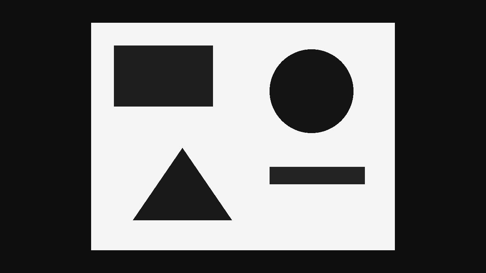
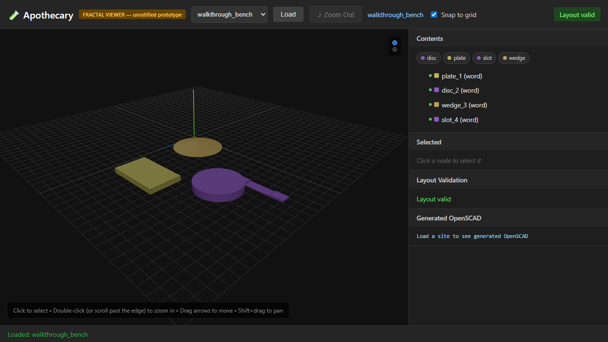
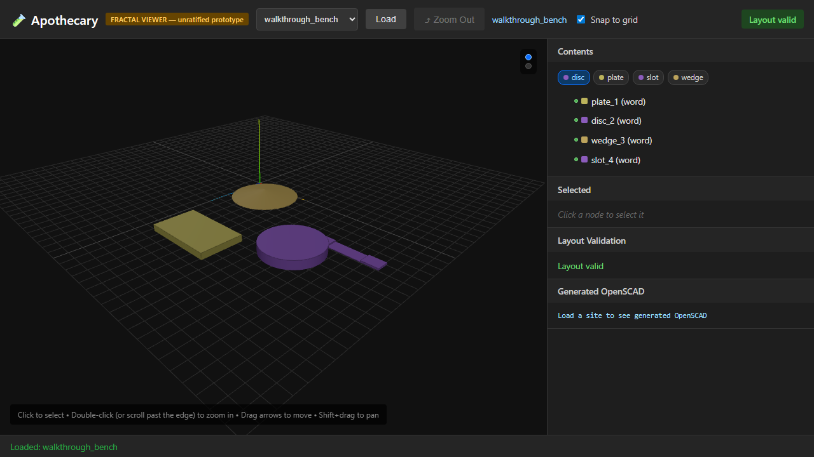
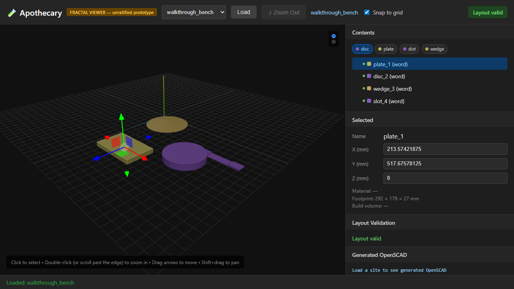

# 11 — Photographs into pieces you could print

**This page is written by the run it describes.** Every sentence below
was emitted by a test that had just asserted it, and the whole page is
rewritten by the ordinary test command. Editing it by hand is editing
the output of a program: the next run puts it back.

Point the tool at a photograph. It finds the flat shapes in it, matches each one to a named, reusable word, places them in space, sorts a folder of them into what belongs with what, asks you the questions it cannot settle, and shows the result in the viewer it already had. Nothing claims to be measured unless somebody said how wide the picture is.

**Runtime-bound.** It draws its own photographs and reads them back, then walks the same pieces in a real browser against a real server. It needs no network. It does need a browser and a running server, which is the price of this page and the viewer's page being one page.

---

## 1. A photograph becomes shapes

The finder is deliberately plain: it shrinks the picture, splits light from dark, gathers touching pixels, and guesses each blob from how much of its box it fills. This one was drawn to order, so the answer is known.

```
4 shapes found in same0_a
```

## 2. Nothing there is a measurement

A photograph on its own cannot say how big anything is, so every position comes back as a fraction of the picture.

```
x from 0.754 to 0.918, y from 0.141 to 0.362
```

## 3. Each shape gets a name, and says how sure it is

A word is a recipe that builds an ordinary node, so a named shape is something the rest of the tool already knows how to handle. The confidence is never rounded up. It is measurably lower when the finder is wrong, which is what makes it worth reporting at all.

```
plate, 0.64 sure
```

## 4. Placed, and honest about not being measured

Give it no real-world size and the pieces are still placed, marked as having no size rather than quietly given one. Every piece carries where it came from.

```
4 pieces, sized=False
first piece seen by the 'plain' finder, thickness guessed: True
```

## 5. Several photographs at once, and which are of the same thing

Some of these are of one thing, some are neighbouring parts of something bigger, and some are of nothing in particular. A photograph with nothing in it is set aside with a reason rather than quietly dropped.

```
11 photographs read
blankset_empty set aside: only 0 shape(s) were found, and 2 is the fewest that makes an arrangement
```

## 6. Every answer says why, and 'cannot tell' is an answer

The sorting is conservative on purpose: it would rather decline a pair than guess at it. A pair it cannot decide comes back as a real answer with a reason attached, not as a gap in the output.

```
2 group(s) built, 29 pair(s) declined
same0_a and same0_b: the same thing, because 4 matching shapes line up under one step and zoom (1.00×, 0% out); 2 other match(es) do not fit and were dropped
```

## 7. You are better at this than it is, so it asks

It works out which questions are worth a minute, best first, by how many other pairs an answer would settle. A person answers in plain sentences, and the whole language is five of them.

```
Are apart0_a and blankset_a photographs of the same thing?
```

## 8. Their word wins, carries, and marks the machine

A person's answer beats the machine's outright, builds the group that follows from it, and says who decided. It also scores the machine, because an answered pair is a pair where the answer is known.

```
parts0_left and parts0_right: parts of one thing, said by you
the group it makes: ['parts0_left', 'parts0_right']
scorecard: {'you answered': 2, 'about a pair': 1, 'about one picture': 1, 'agreed': 0, 'overruled': 0, 'silent': 1}
```

## 9. Two answers that contradict each other are refused

Not averaged, and not last-one-wins. The refusal names both lines, because the person who wrote them is the only one who can settle it.

```
line 2 says 'a and b are the same thing' and line 3 says 'b and a are not related'. Both cannot be true, and picking one would mean a machine deciding which person was right. Nothing was merged. Delete or correct one of the two.
```

## 10. The same path, now against a real server

This is the picture the rest of the page is about: 800 by 600 pixels, 4 shapes found by the 'plain' finder. Everything above ran in this process. Everything below runs through the server and a browser.



## 11. Told how wide it is, the pieces get real sizes

Nine hundred millimetres across, so the pieces have sizes rather than fractions. That a machine picked every one of these shapes is recorded separately from whether they have a size, because they are different claims.

```
words: disc, plate, slot, wedge
sized: True
```

## 12. The arrangement opens in the viewer the tool already had

No drawing code was written for any of this. An arrangement built from a photograph is an ordinary arrangement, so the viewer already knew how to show it.


## 13. Every piece is listed, named for the word it was matched to

The names in this list are the words from the top of this page. One vocabulary runs the whole length of the path.



## 14. Filtering to 'disc' keeps that word and sets the rest aside

The filters the viewer already had are filters by word now, because the pieces simply carry their word.



## 15. Choosing a piece shows where it came from

Which finder saw it, how sure it was, and that its thickness is a guess: the same provenance the model half printed, in front of a person.



## 16. And it forgets on request

The picture it was all built from is served beside the arrangement while the arrangement exists, and both go when the arrangement is forgotten.

## 17. What the whole thing costs a person

Two meters, because a tool that is pleasant to demonstrate and expensive to use is neither. The first counts the controls the viewer puts on screen, and unifying means it reaches nothing rather than a smaller pile. The second counts what a person types to reach a named job, and every job carried by nothing but typing is an open item about where the interface stops.

```
20 controls of the viewer's own
10 typed steps, 7 job(s) carried by nothing but typing
```

## What this page does not show

- **A real photograph.** Everything here is drawn to order, which is how the answers are known. Shadow, texture, blur and clutter are all absent, so a good showing here means it handles the easy case.
- **A printable model.** Turning an arrangement into a solid needs a program this run does not install. Nothing below the arrangement is exercised.
- **Anything about how long it takes.** No timing is asserted anywhere in this run.
- **Anything surviving a restart.** Nothing here is stored. The run builds what it needs and forgets it.

Run it yourself:

```sh
uv run apothecary test run --e2e
```
