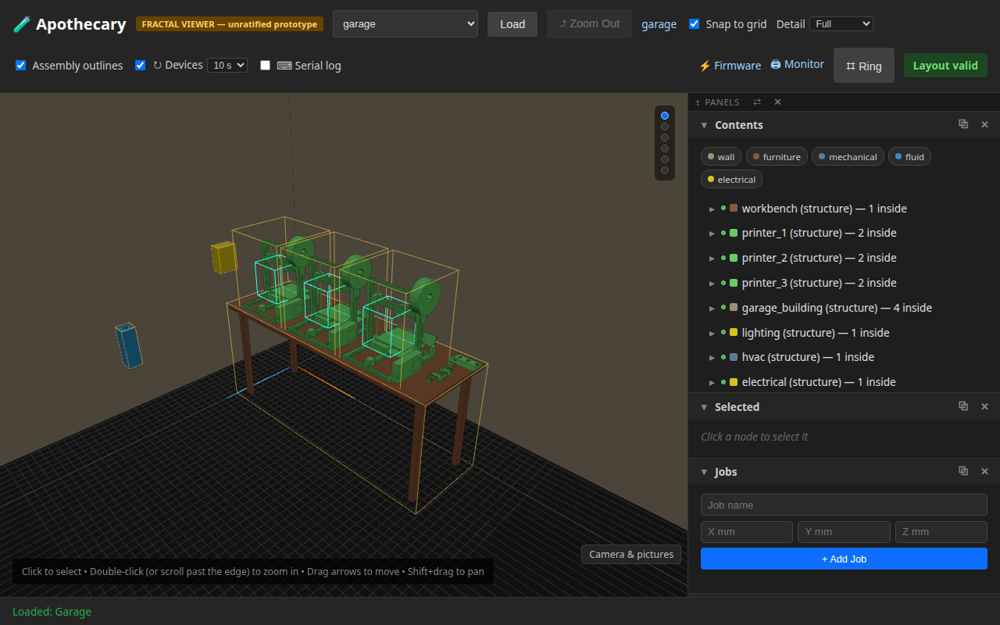
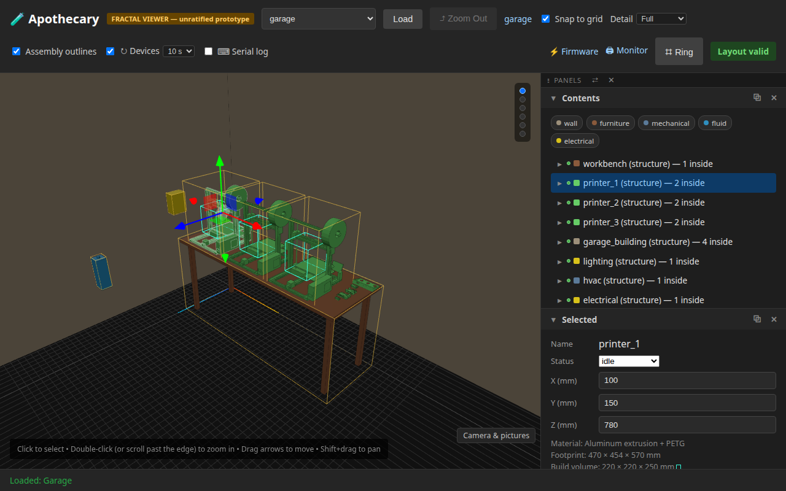
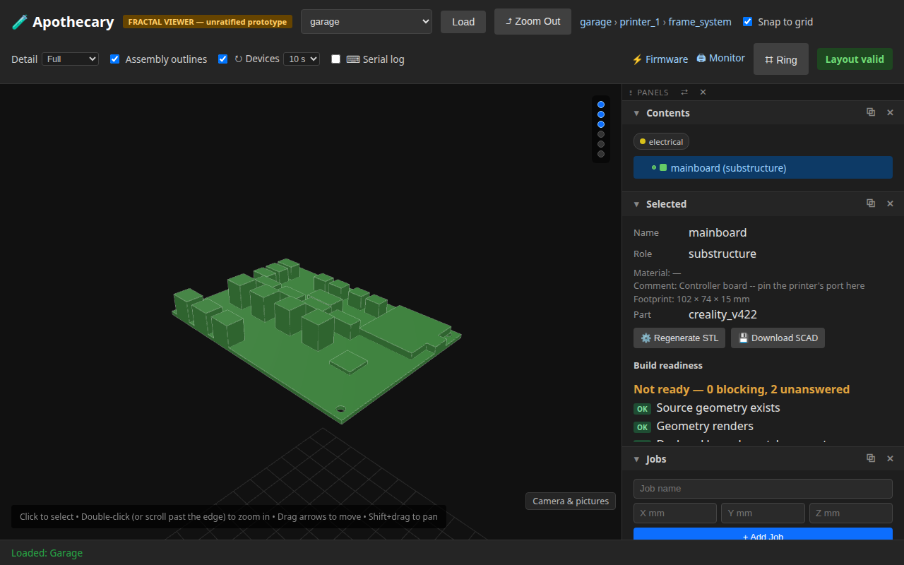
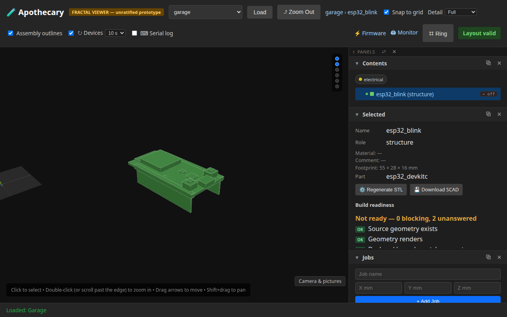
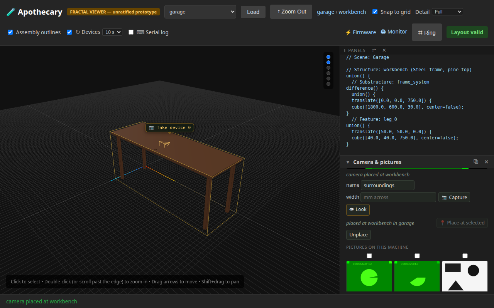
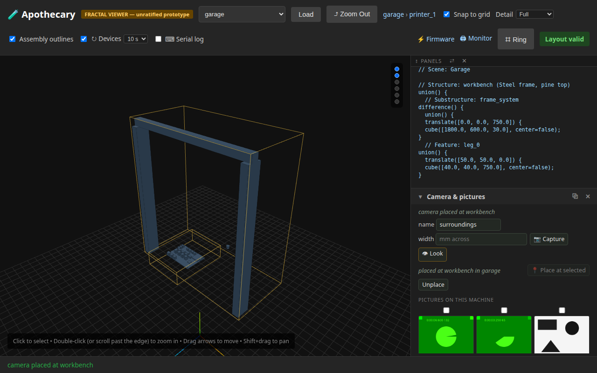

# 12 — The bench as it is, and a camera looking at it

**This page is written by the run it describes.** Every sentence below
was emitted by a test that had just asserted it, and the whole page is
rewritten by the ordinary test command. Editing it by hand is editing
the output of a program: the next run puts it back.

A mesh made in another program is brought in measured, not trusted; a part can be a folder with a sidecar and no Python; the garage's printers are Ender 3s from published dimensions and its boards are the boards. A camera placed at a piece is drawn there, at the level where that piece is, and nowhere else. And nothing here leaves the machine, by construction rather than by anyone's care.

**Runtime-bound.** The model half runs in this process. The browser half drives a real browser against a real server; the browser is launched with a fake camera so there is one to place. It needs no network, and it refuses one.

---

## 1. A file made elsewhere is measured, not trusted

The file says nothing about its units or which way is up, so the person bringing it in says both, and the mesh is turned into millimetres, Z-up, before anything reads its size. `apothecary parts import` does exactly this and keeps the answer beside the file, with where it came from.

```
in the file: 1.0 x 2.0 x 0.5 (inches, Y up)
kept: x 0.0..25.4  y -12.7..0.0  z 0.0..50.8 mm, Z up
```

## 2. Or moved in the model rather than in the file

The same turns as OpenSCAD transforms, so a file that is not in the scene's frame can be left as it is; `bounds()` reads the file and says where the transformed mesh ends up, which is the footprint that places it.

```
rotate([90.0, 0.0, 0.0]) scale(25.4) import(...)
ends up at z 0.0..50.8 mm
```

## 3. A part can be a folder with a sidecar and no Python

A `part.json` beside a SCAD says what a wrapper module would have said: category, colour, bounds, and who made it under what licence. The registry names such a part's wrapper anyway, and importing that name builds the part from the sidecar.

```
apothecary.projects.parts.described.esp32_devkitc
electrical; Quaternion Media, MIT; 56 x 28 x 17.1 mm
```

## 4. The printers are Ender 3s from published dimensions

A printer node names the part it is, and its children live inside it: the Creality mainboard in the electronics box, the gantry at the uprights. `build_origin` puts the bed where it is, so a job's build volume and a board's marks stand on the real bed rather than on the floor.

```
printer_1: part ender3, 470 x 454 x 570 mm overall
bed at z = 95; mainboard: part creality_v422
```

## 5. The bench at the garage's root: three Ender 3s on it, the boards at its right end

The root shows the whole building; here the view is framed on the bench. Every machine and board is the part it names, drawn from its own STL, and the site places each by its footprint.



## 6. A printer is the part it names

Selecting printer_1 shows its rows and, below them, the part its body is. The power supply stands on the right behind the upright, the spool on its bracket over the top bar, the electronics box under the bed at the front.



## 7. Inside it, the mainboard is the Creality V4.2.2

Zoomed into the printer's frame, its children are drawn and the printer's body is not: the board in its box, with the pins that would be pinned to a port. Its outline, holes, headers and jacks are from the maker's drawing.



## 8. The DevKitC standing on its pins

esp32_blink is a sketch and the board it runs on, drawn as the board: the described part from the model half of this page, in the world.



## 9. A camera placed at the bench is drawn there

Allowed in the Camera panel and placed at the selected piece, the camera gets a badge above the bench and a small frustum at it, kept on the server so every browser looking at this site sees it standing there.



## 10. Looking into a printer, the camera's mark stays at the bench

A mark is drawn at the level where its piece is. Zoomed into something else, neither the badge nor the frustum follows; zooming back out brings both back.



## 11. Unplaced, it leaves the world

The placement is a record on this machine and nothing more; taking it back removes the mark for every browser.

```
GET /cameras?site=garage -> []
```

## 12. And none of it leaves the machine

The guard is on the process, installed when the package is imported: a connection past this machine is refused before any name is looked up. The server answers this machine alone; a page from anywhere else asking it for the cameras gets a refusal, not the list. Neither is a setting.

```
socket.create_connection: refused to reach ('example.com', 80). Apothecary keeps personal data on this machine by construction; nothing in it connects anywhere else. (The named exception, secured user accounts, is not built.)

Origin: http://elsewhere.test -> 403 Apothecary answers this machine only. Personal data stays on the device by construction; the named exception, secured user accounts, is not built.
```

## What this page does not show

- **A real camera.** The camera placed here is Chromium's test pattern. Nothing of anyone's room is in these pictures.
- **A printer or board that is connected.** The Ender 3s and the boards are drawn as what they are; none is pinned to a port, and the status each shows is the site's own.
- **The import command writing into the repository.** `apothecary parts import` is what brings a file in for keeps; this run measures the file in a temporary folder and leaves `parts/` as it found it.
- **The pieces without OpenSCAD.** A part is drawn from an STL that OpenSCAD renders on first request; on a machine without it the pieces are their footprint boxes. These pictures were made with it.

Run it yourself:

```sh
uv run apothecary test run --e2e
```
