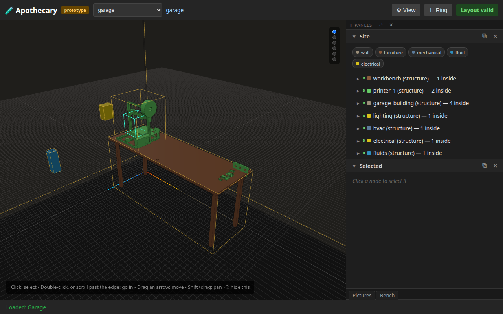
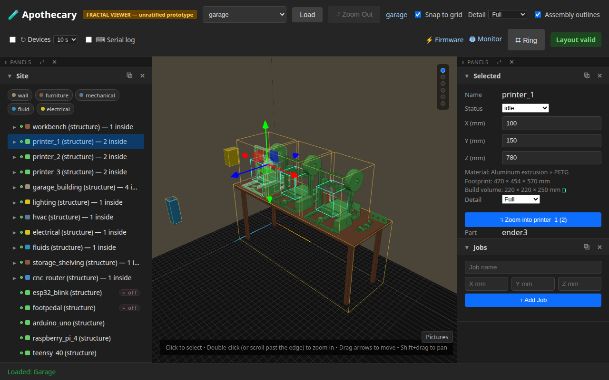
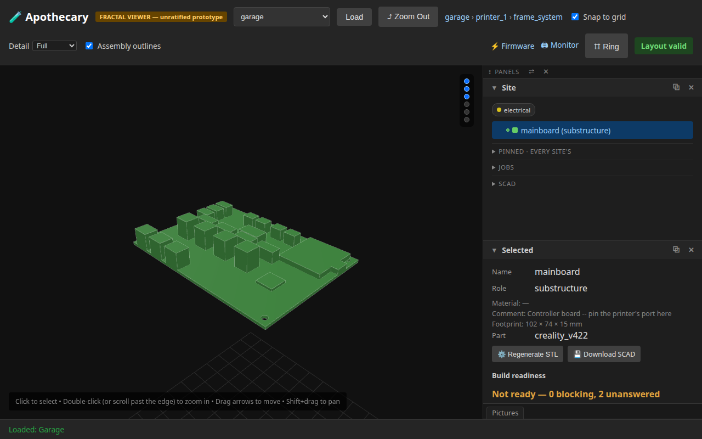
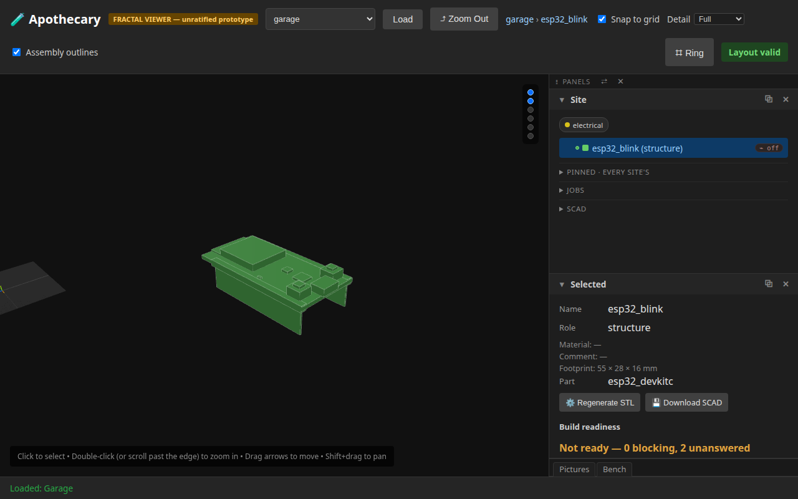
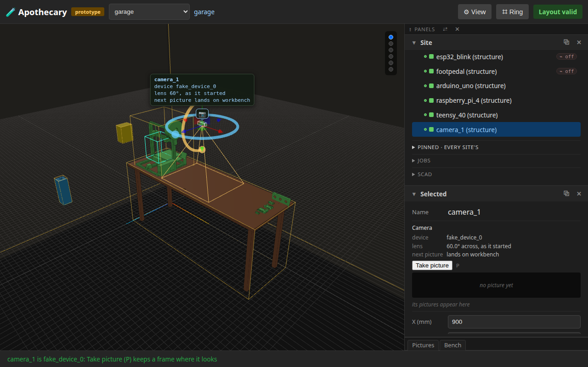
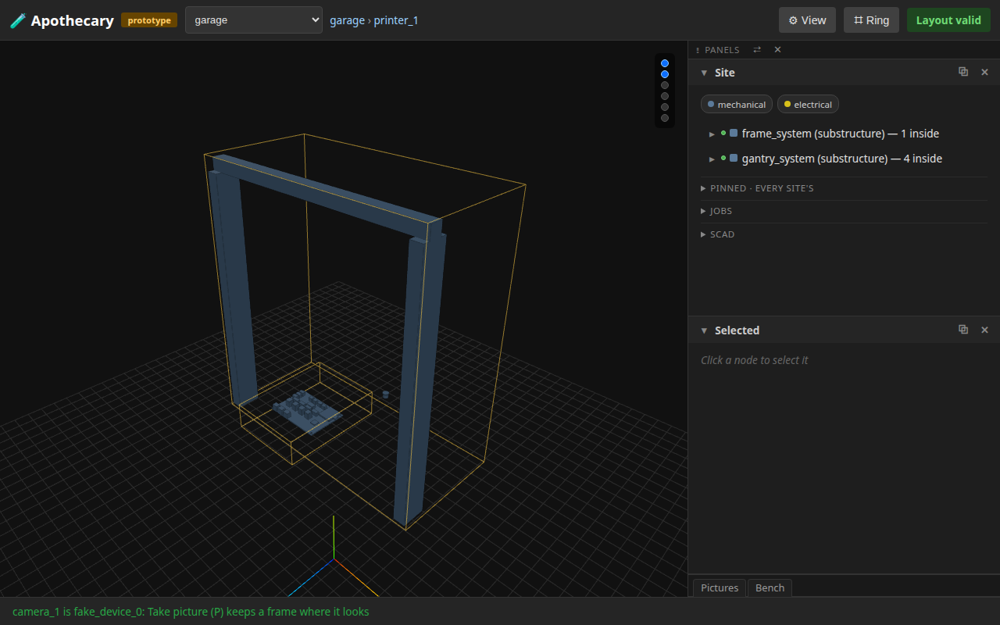
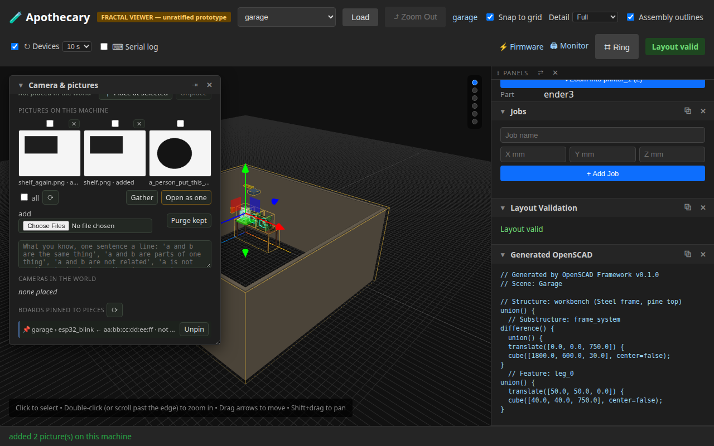

# 12 — The bench as it is, and a camera looking at it

**This page is written by the run it describes.** Every sentence below
was emitted by a test that had just asserted it, and the whole page is
rewritten by the ordinary test command. Editing it by hand is editing
the output of a program: the next run puts it back.

A mesh made in another program is brought in measured, not trusted; a part can be a folder with a sidecar and no Python; the garage's printer is an Ender 3 from published dimensions and its boards are the boards. A camera placed at a piece is drawn there, at the level where that piece is, and nowhere else. And nothing here leaves the machine, by construction rather than by anyone's care.

**Runtime-bound.** The model half runs in this process. The browser half drives a real browser against a real server of its own, whose picture folder holds only the pictures this page puts there; the browser is launched with a fake camera so there is one to place. It needs no network, and it refuses one.

---

## 1. A file made elsewhere is measured, not trusted

The file says nothing about its units or which way is up, so the person bringing it in says both, and the mesh is turned into millimetres, Z-up, before anything reads its size. `apothecary parts import` does exactly this and keeps the answer beside the file, with where it came from.

```
in the file: 1.0 x 2.0 x 0.5 (inches, Y up)
kept: x 0.0..25.4  y -12.7..0.0  z 0.0..50.8 mm, Z up
```

## 2. Or moved in the model rather than in the file

The same turns as OpenSCAD transforms, so a file that is not in the scene's frame can be left as it is; `bounds()` reads the file and says where the transformed mesh ends up, which is the footprint that places it.

```
rotate([90.0, 0.0, 0.0]) scale(25.4) import(...)
ends up at z 0.0..50.8 mm
```

## 3. A part can be a folder with a sidecar and no Python

A `part.json` beside a SCAD says what a wrapper module would have said: category, colour, bounds, and who made it under what licence. The registry names such a part's wrapper anyway, and importing that name builds the part from the sidecar.

```
apothecary.projects.parts.described.esp32_devkitc
electrical; Quaternion Media, MIT; 56 x 28 x 17.1 mm
```

## 4. The printer is an Ender 3 from published dimensions

A printer node names the part it is, and its children live inside it: the Creality mainboard in the electronics box, the gantry at the uprights. `build_origin` puts the bed where it is, so a job's build volume and a board's marks stand on the real bed rather than on the floor.

```
printer_1: part ender3, 470 x 454 x 570 mm overall
bed at z = 95; mainboard: part creality_v422
```

## 5. The bench at the garage's root: an Ender 3 at its left end, the boards at its right end

The root shows the whole building; here the view is framed on the bench. Every machine and board is the part it names, drawn from its own STL, and the site places each by its footprint.



## 6. A printer is the part it names

Selecting printer_1 shows its rows and, below them, the part its body is. The power supply stands on the right behind the upright, the spool on its bracket over the top bar, the electronics box under the bed at the front.



## 7. Inside it, the mainboard is the Creality V4.2.2

Zoomed into the printer's frame, its children are drawn and the printer's body is not: the board in its box, with the pins that would be pinned to a port. Its outline, holes, headers and jacks are from the maker's drawing.



## 8. The DevKitC standing on its pins

esp32_blink is a sketch and the board it runs on, drawn as the board: the described part from the model half of this page, in the world.



## 9. A camera added above the bench is drawn there

Added from the bench's own ring -- Camera, Add here -- a camera part stands above the bench looking straight down: its body, its 📷 badge and, while it is selected, its pyramid from the lens to the bench's top, with a ring to turn it and an arc to tilt it beside the move arrows. Its own ring's Device says which of this browser's cameras it is. It is kept on the server, so every browser looking at this site sees it standing there. The status bar names the next step, Take picture (P), which keeps a frame where it looks.



## 10. Looking into a printer, the camera stays in the garage

A camera is a piece of the site, drawn at the level its site is. Zoomed into something else, neither its badge nor its pyramid follows; zooming back out brings them back.



## 11. Removed, it leaves the world

A camera is a piece of the site and a record on this machine, and nothing more; removing it takes it out of the site for every browser. The pictures it took stay.

```
GET /sites/garage/attached -> cameras: []
```

## 12. What the browser put here, it can take back

Site's Pinned lists what a page pinned -- cameras, views, boards -- every site's, each row naming its site and carrying the button that takes it back, from here, without switching to that site; a pin whose site or piece is gone is shown as such, and this is the one place it can be seen. Pictures lists every picture in the picture folder as thumbnails, grouped by the camera that took them -- here none did -- the folder's own and the ones the browser kept (those added from its file picker kept as they were named under uploads/), each with where it is pinned as a view, and Forget on a kept one. A picture kept and pinned nowhere waits to be chosen: one clicked is chosen, as shelf.png is here, and the ring's Picture › Folder pins it where the ring stands -- the seven newest by name, an older one as its last cell -- as the status bar says.



## 13. And a purge forgets only what the browser put here

The pictures a person put in the folder by hand are theirs; the tool never deletes one from a page. What it kept -- a camera's frames, the pictures added here -- it forgets on request, after asking once.

```
forgotten: uploads/shelf.png, uploads/shelf_again.png
left where it was: a_person_put_this_here.png
GET /firmware/pins -> []
```

## 14. And none of it leaves the machine

The guard is on the process, installed when the package is imported: a connection past this machine is refused before any name is looked up. The server answers this machine alone; a page from anywhere else asking it for a site's cameras and pictures gets a refusal, not the list. Neither is a setting.

```
socket.create_connection: refused to reach ('example.com', 80). Apothecary keeps personal data on this machine by construction; nothing in it connects anywhere else. (The named exception, secured user accounts, is not built.)

Origin: http://elsewhere.test -> 403 Apothecary answers this machine only. Personal data stays on the device by construction; the named exception, secured user accounts, is not built.
```

## What this page does not show

- **A real camera.** The camera placed here is Chromium's test pattern. Nothing of anyone's room is in these pictures.
- **A printer or board that is connected.** The Ender 3 and the boards are drawn as what they are; none is pinned to a port, and the status each shows is the site's own.
- **The import command writing into the repository.** `apothecary parts import` is what brings a file in for keeps; this run measures the file in a temporary folder and leaves `parts/` as it found it.
- **The pieces without OpenSCAD.** A part is drawn from an STL that OpenSCAD renders on first request; on a machine without it the pieces are their footprint boxes. These pictures were made with it.

Run it yourself:

```sh
uv run apothecary test run --e2e
```
