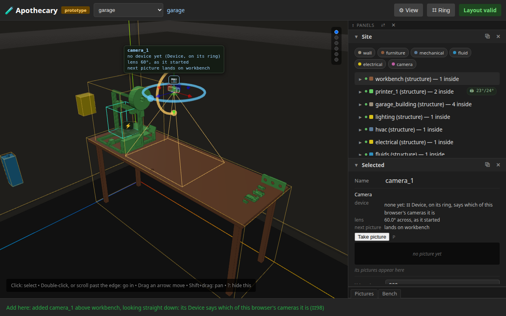
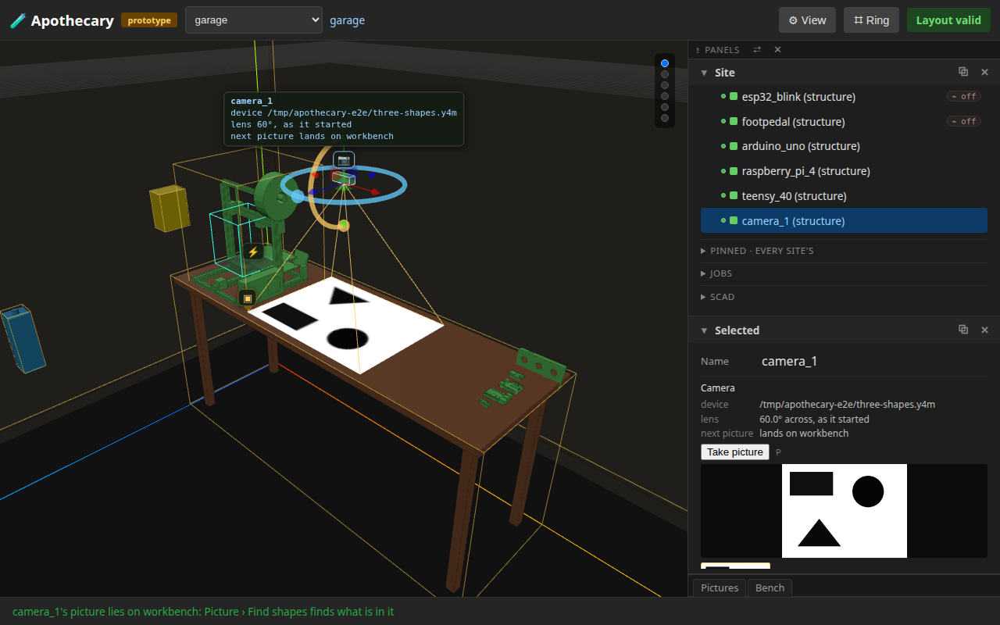
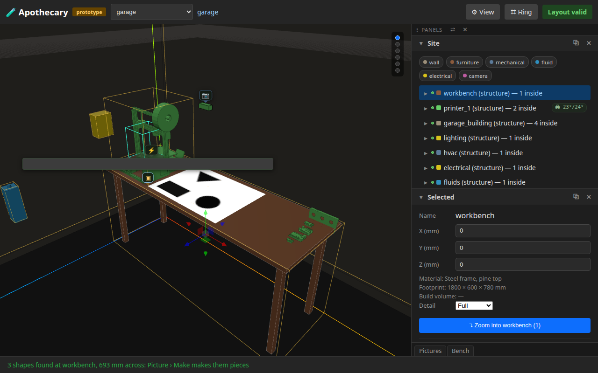
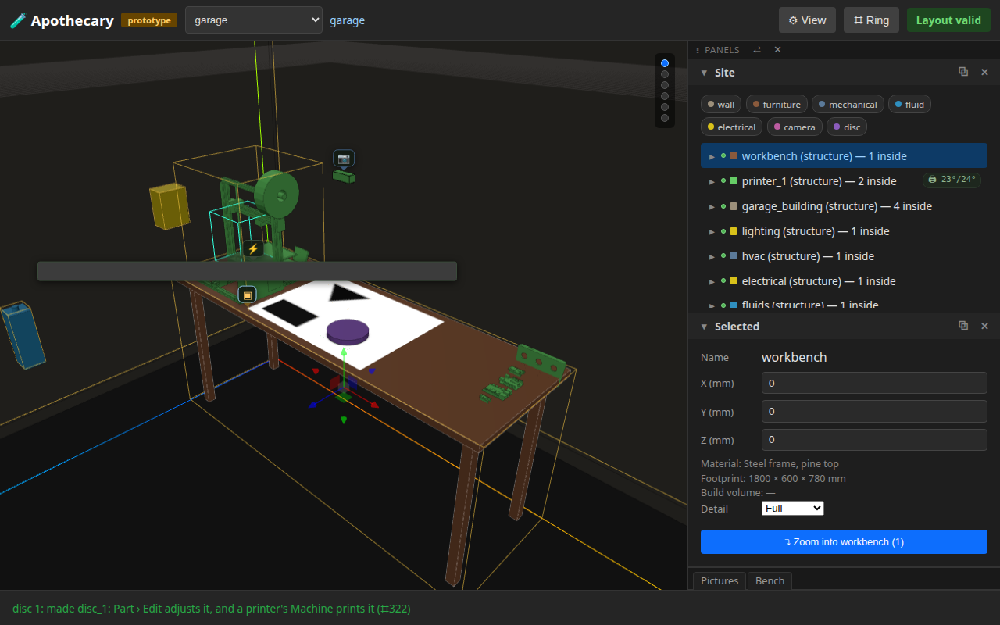
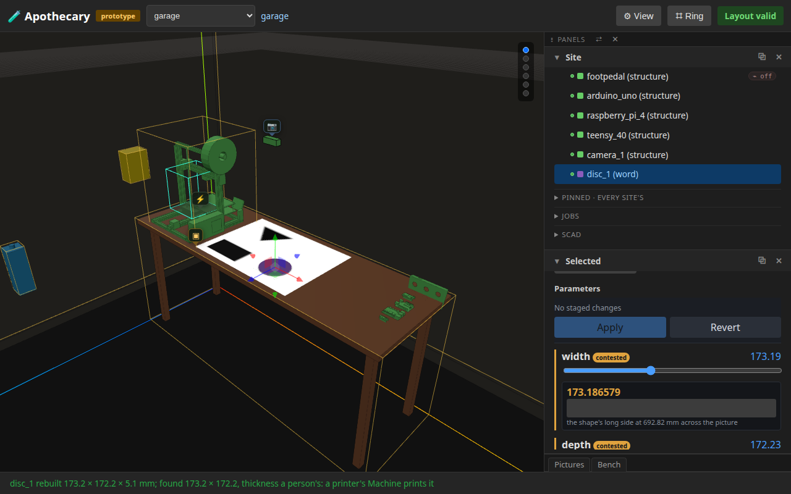
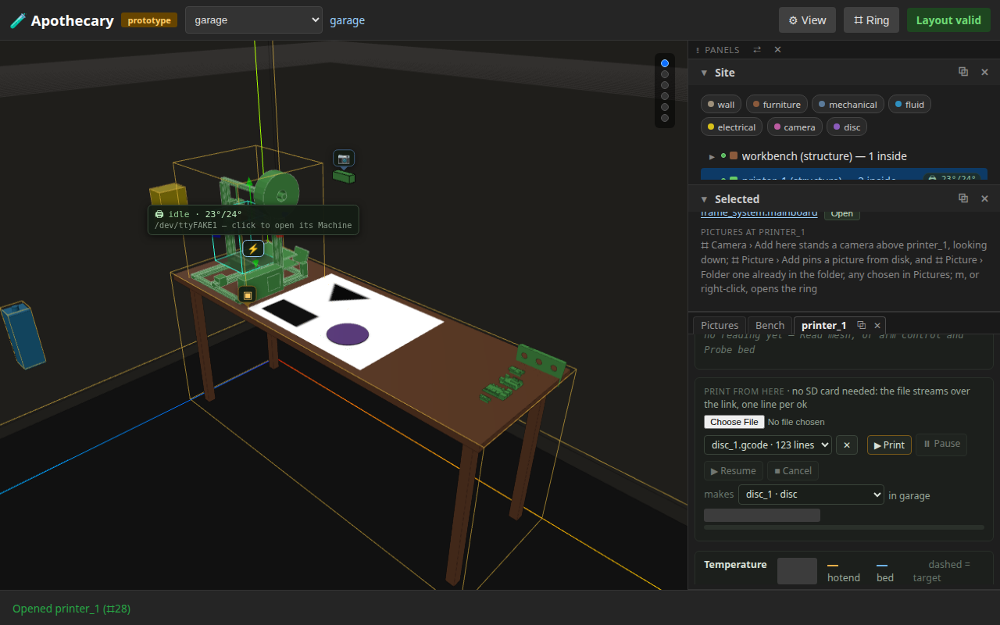
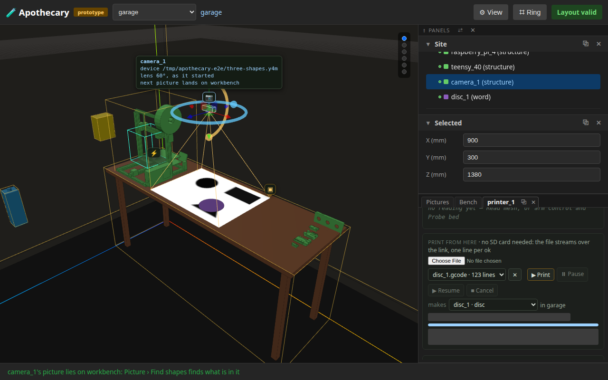
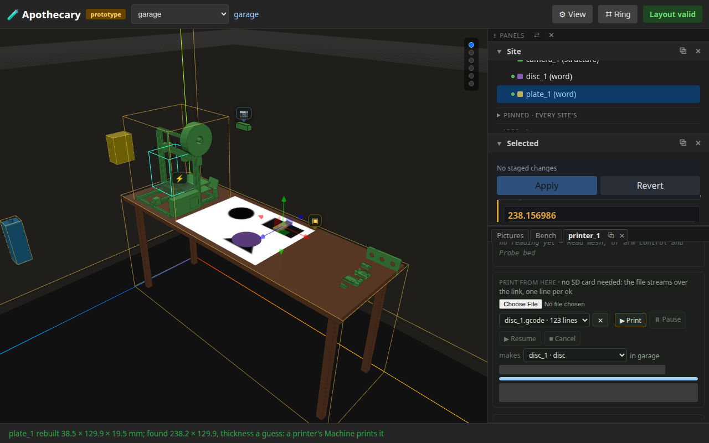
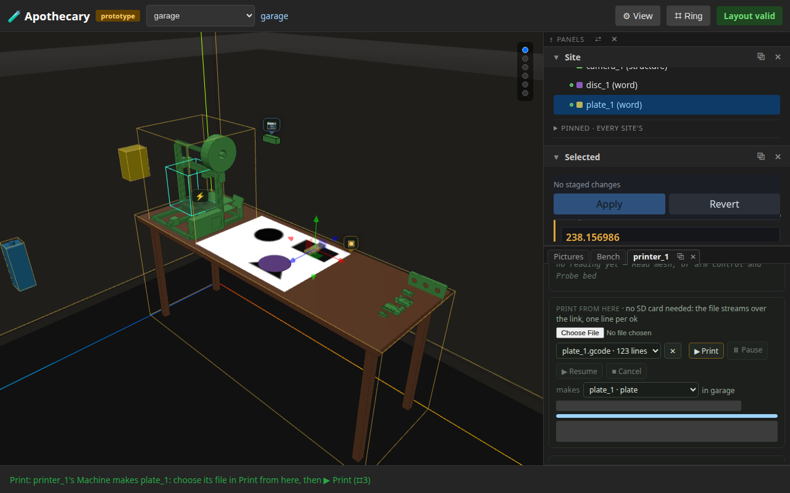
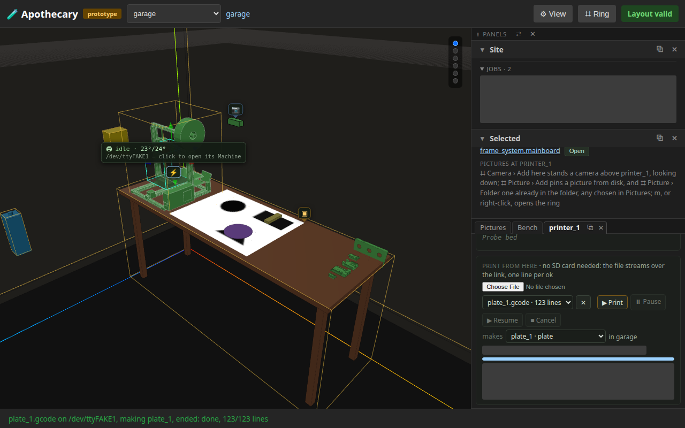

# 13 — A picture to a print

**This page is written by the run it describes.** Every sentence below
was emitted by a test that had just asserted it, and the whole page is
rewritten by every run of the browser suite (`uv run apothecary test
run --e2e`), though not by the quicker `apothecary test run`. Editing it
by hand is editing the output of a program: the next run puts it back.

A camera over the bench, a picture taken, its shapes found, one made a piece, the piece adjusted, and a print job for it on printer_1, watched to its end in printer_1's Machine; then round again with the camera turned, for a second piece and a second print. Every step is the page's own: a cell of a ring, a button, a key or a box, and every step's words name the next one.

**Runtime-bound.** It drives a real browser against a real server of its own. The browser's camera is Chromium's fake one, playing a drawing of three shapes, and the printer is the simulated one, pinned to printer_1's board as the bench's real board is. It needs no network, opens no serial port, and refuses both.

---

## 1. Camera › Add here stands a camera over the bench

The bench's ring, Camera › Add here: camera_1 stands above the bench's middle, looking straight down, selected, a row of Contents. The status line names the next step: its Device.



```
Add here: added camera_1 above workbench, looking straight down: its Device says which of this browser's cameras it is (⌗98)
```

## 2. Device says which of this browser's cameras it is

The camera's own ring, Device, and the one camera this browser has. The status line names the next step: Take picture, or P.

```
camera_1 is /tmp/apothecary-e2e/three-shapes.y4m: Take picture (P) keeps a frame where it looks
```

## 3. Take picture lays the frame on the bench

The camera's ring, Take picture: the frame is kept, lies on the bench where the camera looks, and is the first thumbnail in the camera's section. Nothing is found in it yet; the status line names Picture › Find shapes.



```
camera_1's picture lies on workbench: Picture › Find shapes finds what is in it
```

## 4. Find shapes outlines what the picture holds

The bench's ring, Picture › Find shapes: the plain finder outlines each shape on the picture where it lies. A camera's picture is sized as it is taken, so the status line names Make at once.



```
3 shapes found at workbench, 693 mm across: Picture › Make makes them pieces
```

## 5. Make stands a shape up as a piece

The bench's ring, Picture › Make and the disc: disc_1 stands on its outline, a row of Contents. The status line names the two steps after it: Part › Edit adjusts it, and a printer's Machine prints it.



```
disc 1: made disc_1: Part › Edit adjusts it, and a printer's Machine prints it (⌗322)
```

## 6. Part › Edit adjusts it in Selected

The piece's ring, Part › Edit: its parameters in Selected, under where it came from. Its thickness, which a picture cannot see, set to 5.1 mm and applied: it is rebuilt where it stands, and the status line names the printer's Machine.



```
disc_1 rebuilt 173.2 × 172.2 × 5.1 mm; found 173.2 × 172.2, thickness a person's: a printer's Machine prints it
```

## 7. printer_1's Machine offers the piece to print

printer_1's ring, Device › Open: its Machine in the rail, beside Selected. Print from here keeps a file a slicer wrote for disc_1, and lists the pieces of the garage under makes; disc_1 is chosen, and control is armed.



## 8. Print starts a job that names the piece

Print from here's ▶ Print asks first, naming the file, the port and disc_1; then the file streams, one line per ok, and the job is the newest of printer_1's history, running. The status line names where it is followed.

```
Print disc_1.gcode on /dev/ttyFAKE1, making disc_1?
123 lines will stream from here; the printer will heat and move.

started disc_1.gcode on /dev/ttyFAKE1, making disc_1: Print from here follows it to its end, and Site's Jobs lists it
```

## 9. The job ends, and says so where it is watched

The status line says the print ended and how; the Machine's progress reads done, every line sent; its history keeps the job with the piece it made, and Site's Jobs lists it under printer_1. The job's record keeps the picture and the camera the piece came from, and its row does not show them.

```
disc_1.gcode on /dev/ttyFAKE1, making disc_1, ended: done, 123/123 lines
disc_1.gcode · done · 123/123 lines (100.0%)
printer_1 · print · disc_1.gcode → disc_1 · done
```

## 10. Turned by its ring, the camera takes a second picture with P

camera_1 selected wears its turn ring; dragged half a turn, its next picture lands on the bench the other way round. P takes it: the second thumbnail, and the status line names Find shapes again.



```
camera_1 turned to 180°: its next picture lands on workbench
camera_1's picture lies on workbench: Picture › Find shapes finds what is in it
```

## 11. A second piece, made and adjusted

Find shapes and Make on the second picture: plate_1 stands beside disc_1. Part › Edit narrows it to 38.5 mm and applies it.



```
plate_1 rebuilt 38.5 × 129.9 × 19.5 mm; found 238.2 × 129.9, thickness a guess: a printer's Machine prints it
```

## 12. Print, on the piece's ring, chooses it in printer_1's Machine

plate_1's ring ends with Print, a printer being pinned in the garage: it brings printer_1's Machine forward with plate_1 chosen under makes -- listed there already, though the Machine stayed open while it was made -- and the status line names the next step. A file sliced for it is kept beside it.



```
Print: printer_1's Machine makes plate_1: choose its file in Print from here, then ▶ Print (⌗3)
```

## 13. Send file prints the second, and both jobs name their pieces

printer_1's ring, Device › Control › Print › Send file, prints what the card has chosen: plate_1, and the status line says when it ends. The Machine's history and Site's Jobs keep both jobs, newest first, each with the piece it made.



```
plate_1.gcode on /dev/ttyFAKE1, making plate_1, ended: done, 123/123 lines
printer_1 · print · plate_1.gcode → plate_1 · done
printer_1 · print · disc_1.gcode → disc_1 · done
```

## What this page does not show

- **A real camera or a real printer.** The camera plays a drawing and the printer is a simulation that answers as Marlin does; their real runs are steps of the bench checklist.
- **Slicing.** The G-code each print streams is a short file kept through the card's own file box, as a file a slicer wrote from the piece would be. Apothecary keeps, checks and streams G-code; it does not make it.
- **A print that heats.** The file moves the head and dwells; it sets no temperature, so the simulated hotend and bed stay cold.
- **What changes on every run.** When a print started and ended, how long it took, and the names pictures are kept under (the time each was taken) are blanked in the pictures and left out of the words, so this page changes when the loop does, not when the clock does. A running print is described rather than pictured, for the same reason.

Run it yourself:

```sh
uv run pytest tests/e2e/test_picture_to_print.py --start-server   # this page alone
uv run apothecary test run --e2e                                  # with every browser test
```
