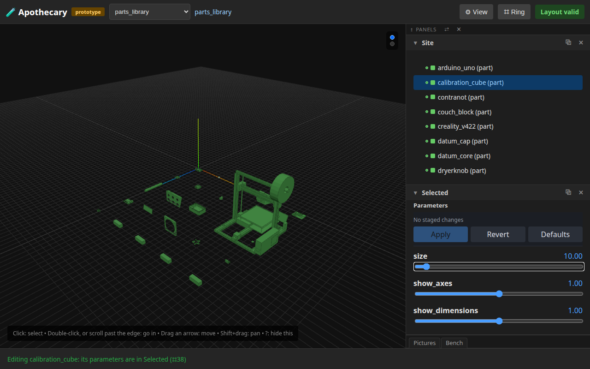
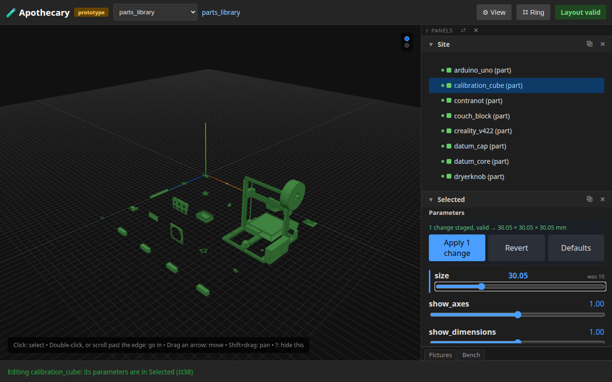
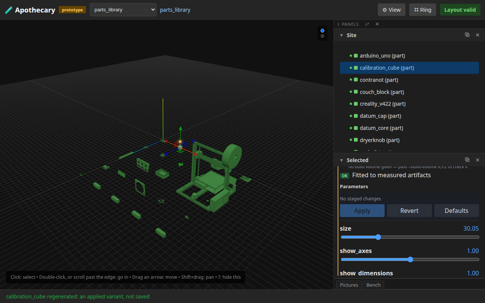
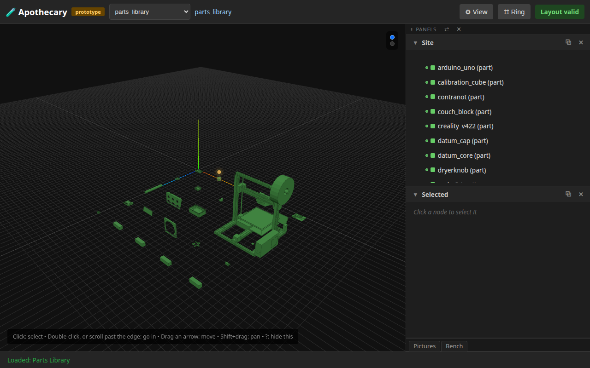
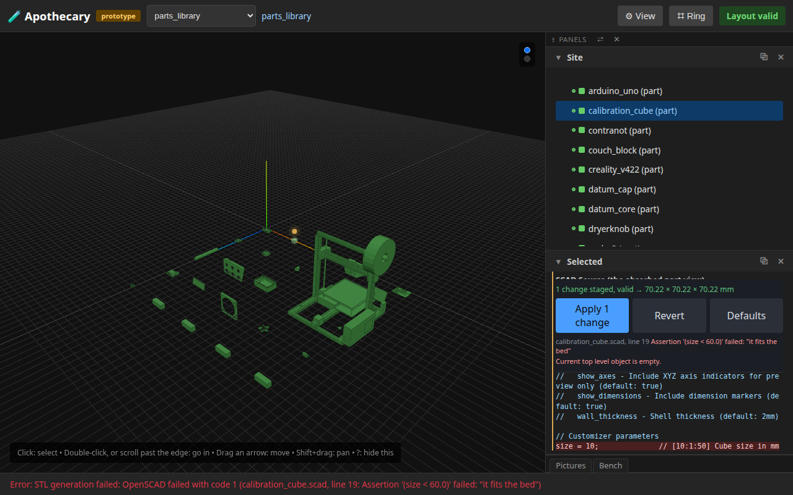
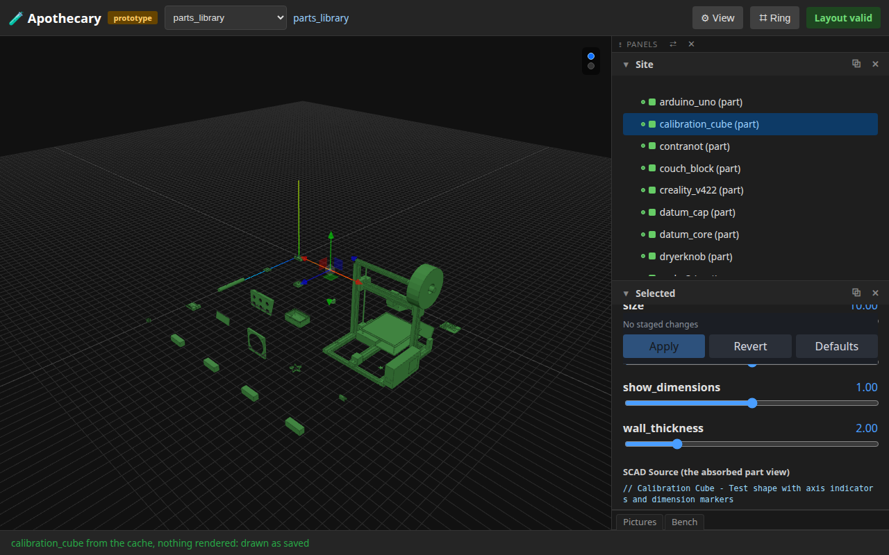
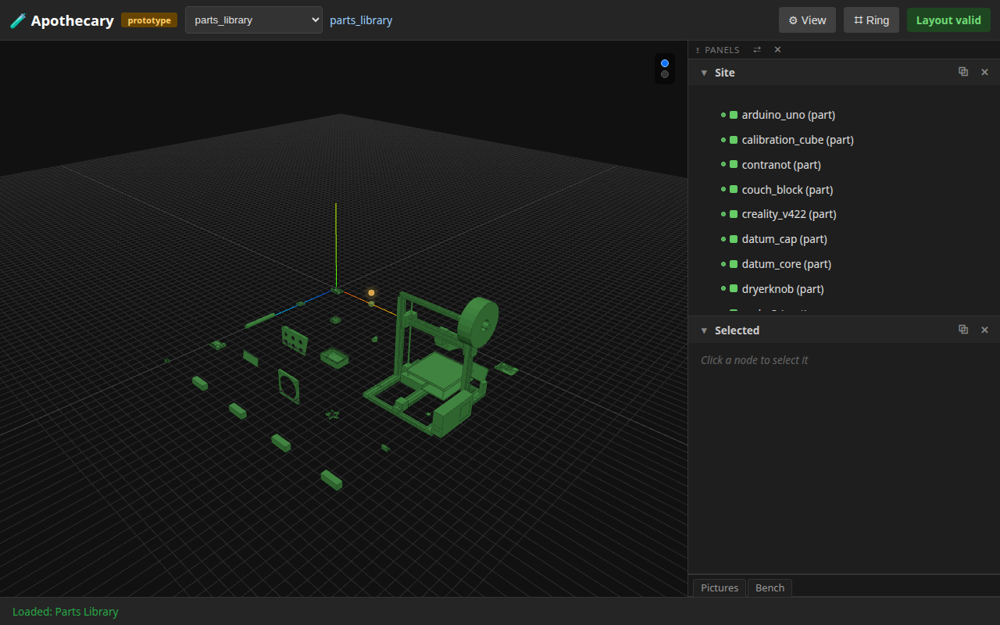

# 14 — Designing a part

**This page is written by the run it describes.** Every sentence below
was emitted by a test that had just asserted it, and the whole page is
rewritten by the browser suite (`uv run apothecary test run --e2e`). Editing it by hand is editing
the output of a program: the next run puts it back.

A part chosen from its ring, a size moved and checked, Apply drawing it in this tab with what it measures beside what it declares, a reload drawing it again, OpenSCAD's refusal shown by line, the saved part again for nothing; then round again, and two tabs applying at once. Every step is the page's own: a cell of a ring, a slider or a button, and every step's words name the next one.

**Runtime-bound.** It drives a real browser against a real server of its own, whose OpenSCAD is this machine's except that it refuses a cube of 60 mm or more, as an assertion at the SCAD's size line would, so that the error met is OpenSCAD's own shape. Its cache of variants is a temporary folder. It needs no network, and refuses one.

---

## 1. Part › Edit opens the part's editor at what is drawn

calibration_cube's row in Site, its ring, Part › Edit: its parameters in Selected. They start from what is drawn, the part's own STL as its params sidecar records it, and beside the envelope the part declares is what that STL measures. Nothing marks it: it is the saved part. A slider is the next step.



## 2. A size dragged is checked once the slider rests

The size slider dragged through 5 values without a pause: one check, once it rests, against the part's own model, and the envelope the staged set would produce. Nothing is rendered yet; Apply is the next step.



```
1 change staged, valid → 30.05 × 30.05 × 30.05 mm
```

## 3. Apply draws the variant, marked as not saved

Apply: rendered into the cache of variants and drawn in this tab at the size staged, and measured beside the envelope the part declares. The editor's amber edge and its words, and an amber dot over the part in the world, say it is an applied variant and not the saved part; the status line says so too.



```
calibration_cube regenerated: an applied variant, not saved
```

## 4. A reload draws what the tab applied, marked at a glance

The tab's address keeps the variant, so a reload, a bookmark or a link draws it again, and no other tab is touched. At the library's own framing, with nothing selected, the amber dot over calibration_cube says it is drawn from a variant and not the saved part; its words, on hover, say so.



## 5. Reopened, the editor starts from the variant

Part › Edit again: the size slider stands at 30.05 mm, the variant's, the measured bounds are the variant's, and nothing is staged.

## 6. OpenSCAD's refusal, by line

A size of 70 mm, which this run's OpenSCAD refuses: Apply answers with OpenSCAD's own words, listed by file and line under the stage bar, the line marked in the part's source below, and carried on the status line. What is drawn does not change, and the refused size is still staged.



```
Error: STL generation failed: OpenSCAD failed with code 1 (calibration_cube.scad, line 19: Assertion '(size < 60.0)' failed: "it fits the bed")
```

## 7. Part › Revert puts back what was staged

calibration_cube's ring, Part › Revert: the refused size is put back to what is drawn, 30.05 mm, and nothing is staged. Part › Defaults is the way to the saved part.

```
calibration_cube: what was staged is put back to what is drawn; nothing is staged (⌗34)
```

## 8. Part › Defaults, then Part › Apply: the saved part again, for nothing

calibration_cube's ring, Part › Defaults: the part's own numbers staged in its editor, and the status line names Apply. Part › Apply renders nothing, since the cache already holds the saved part, and draws it: the amber marks are gone, and the address names no variant.



```
calibration_cube from the cache, nothing rendered: drawn as saved
```

## 9. Round two

A second size, 47.07 mm, dragged and checked once, and applied from the part's ring, Part › Apply, as the editor's Apply applies it: rendered, drawn and marked. Then the editor's own Defaults and Apply: the saved part again, nothing rendered.

```
calibration_cube from the cache, nothing rendered: drawn as saved
```

## 10. Two tabs apply at once, and each draws its own

A second tab of the same page: this one stages 23.91 mm and the other 36.20 mm, and both Apply, neither waiting. Each renders into a file of its own and draws its own variant, its address naming it; each, reloaded, draws its own again. This is the first tab, reloaded.



## What this page does not show

- **Editing the SCAD.** The part's source is shown read-only, its refused line marked; an editor in the page is the next loop's.
- **A variant kept for good.** An applied variant lives in its tab's address and the cache, which keeps the most recently drawn of each part; saving one is a variant in git, the next loop's too.
- **Which OpenSCAD measured.** The editor says whether the measured bounds are OpenSCAD's own summary of the render or were read off the STL; which it is depends on the machine's OpenSCAD, so the words here leave it out.
- **What changes from machine to machine.** A variant's key is a hash of what made it, its OpenSCAD among them; the address that carries it is not in the pictures, nor in the words.

Run it yourself:

```sh
uv run apothecary test run --e2e
```
