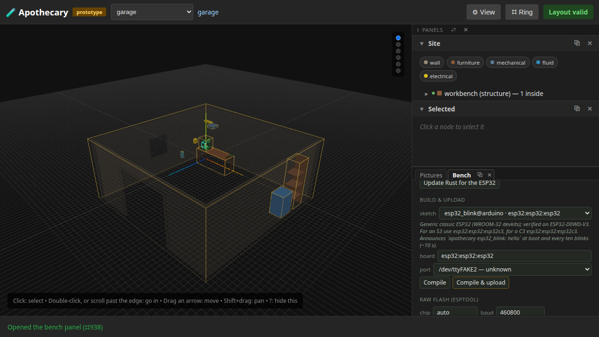
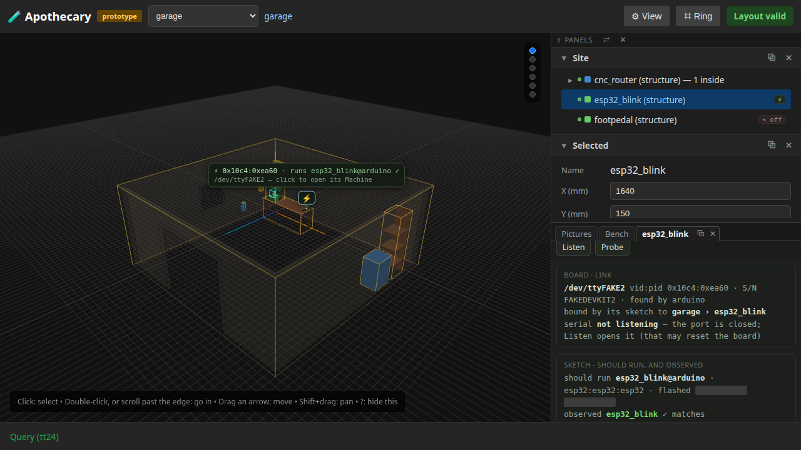
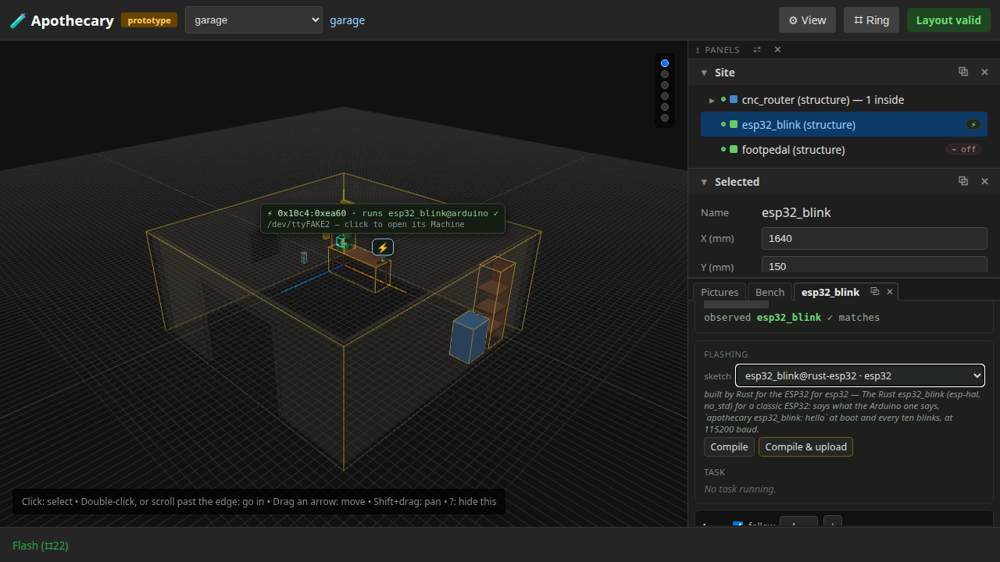
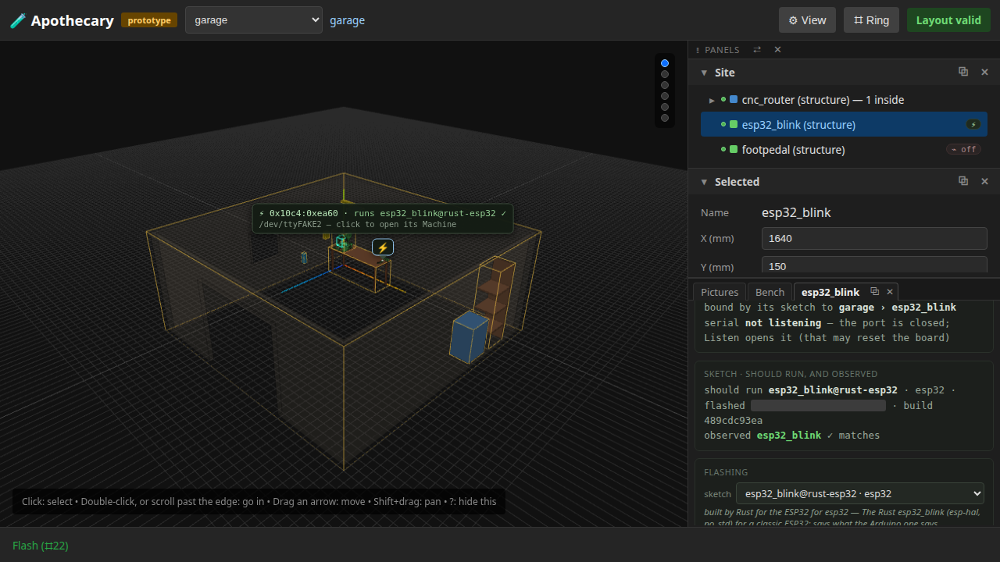

# 15 — Firmware

**This page is written by the run it describes.** Every sentence below
was emitted by a test that had just asserted it, and the whole page is
rewritten by the ordinary test command. Editing it by hand is editing
the output of a program: the next run puts it back.

A sketch chosen, built, flashed to the ESP32 devkit on the bench, and heard saying its hello in the board's Machine; then changed and round again. The first time it is the Arduino esp32_blink, from the Bench; the second, the Rust one, from the board's own Machine. Both say the same hello, so the board runs the sketch the garage's esp32_blink expects either way, and the Machine says which build it is. Every step is the page's own: a cell of a ring, a button or a drop-down, and every step's words name the next one.

**Runtime-bound.** It drives a real browser against a real server of its own. arduino-cli, cargo and espflash are scripted stand-ins in one folder, and the devkit is a simulated one on /dev/ttyFAKE2 that runs whatever was last flashed to it and says that sketch's hello. It needs no network, opens no serial port, builds nothing for real, and refuses all three.

---

## 1. The Bench lists both builds of esp32_blink, each with its toolchain

Panels › Bench on the canvas ring opens the Bench: the toolchains as installed, arduino-cli and Rust for the ESP32 beside it, and the sketches under parts/, each named with its toolchain -- the Arduino esp32_blink and the Rust one next to each other. The Arduino one chosen, its board filled in from its firmware.json, and the devkit's port: Compile is next.



```
esp32_blink@arduino · esp32:esp32:esp32
esp32_blink@rust-esp32 · esp32
```

## 2. Compile builds it for its board

Panels › Bench › Compile (⌗932) builds what the Bench has chosen, as a task whose output is in the Bench's log; nothing is sent to a board. Upload is next.

```
succeeded — Compile esp32_blink@arduino (esp32:esp32:esp32)
```

## 3. Upload writes it to the devkit, after asking

Panels › Bench › Upload (⌗934) asks first, naming the sketch with its toolchain and the port; then it builds again and uploads that fresh build. The garage's esp32_blink, which runs the sketch of that name, now wears the board.

```
Compile and upload "esp32_blink@arduino" to /dev/ttyFAKE2?
succeeded — Upload esp32_blink@arduino → /dev/ttyFAKE2
```

## 4. The board's Machine hears it say hello

esp32_blink's ring, Device › Open: the board's Machine, with what it should run -- esp32_blink@arduino, for its board -- and Device › Query, which listens a few seconds for the hello. Heard, the Machine says the board runs what it should. Change it next: Device › Flash.



```
listening 6 s for the sketch's hello
heard esp32_blink say hello
should run esp32_blink@arduino · esp32:esp32:esp32 · flashed …
observed esp32_blink ✓ matches
```

## 5. Device › Flash, and the Rust esp32_blink chosen

esp32_blink's ring, Device › Flash (⌗22): the Machine's Flashing card, for this board's port alone, starting from the build it should run. The Rust esp32_blink chosen beside it: it builds for the chip its Cargo project names, so the board box goes. Compile is next.



```
built by Rust for the ESP32 for esp32
```

## 6. Compile builds it with cargo, offline

Compile runs cargo in the sketch's folder, offline, from the crates the install vendored, and then reads the image it built: no folder it was built in, and so no user name, may be in it. Compile & upload is next.

```
succeeded — Compile esp32_blink@rust-esp32 (esp32)
esp32_blink: no build path in the image (9 folders checked)
```

## 7. Compile & upload flashes it with espflash, and the Machine hears the same hello

Compile & upload asks, builds again and flashes that build with espflash; the Machine listens for the hello and hears it. It is the hello the Arduino build said, so the board still runs what esp32_blink expects, and the Machine says it is the Rust build now. Listen is next.



```
Compile and upload "esp32_blink@rust-esp32" to /dev/ttyFAKE2?
upload of esp32_blink@rust-esp32 (esp32): succeeded
heard esp32_blink say hello
should run esp32_blink@rust-esp32 · esp32 · flashed … · build 489cdc93ea
observed esp32_blink ✓ matches
```

## 8. Listen hears the hello on the wire

Listen opens the port, saying it may reset the board, and streams what the board says into the Machine's one log: the hello, the chip line and a blink count, as esp32_blink says them in either build. Release lets the port go.

```
apothecary esp32_blink: hello
chip: ESP32-D0WD-V3 rev 301, 2 core(s), 240 MHz, LED on GPIO 2
blink 1
```

## 9. Opened again, the Machine starts from the Rust build

Closed and opened again by Device › Flash, the Flashing card starts from the build the board should run, esp32_blink@rust-esp32; the next round starts there.

```
esp32_blink@rust-esp32 · esp32
```

## What this page does not show

- **A real board.** The devkit is a simulation that says what esp32_blink says; flashing the bench's own ESP32 and hearing it is step G of the bench checklist (docs/validation/2026-09-20-ender-bench.md).
- **A real build.** The scripted cargo writes a stand-in image; a real one is `apothecary firmware install --rust-esp32` and then the same Compile (docs/firmware.md).
- **Rust with no arduino-cli.** The Rust module finds the devkit and listens to it itself when arduino-cli is not there; this module's last test goes round that way, and writes no page.
- **What changes on every run.** When each task started and each log line arrived, when the board was flashed, and the folders the stand-in tools and the builds live in -- which a task's output names -- are blanked in the pictures and left out of the words, so this page changes when the loop does, not when the clock does.

Run it yourself:

```sh
uv run apothecary test run --e2e
```
